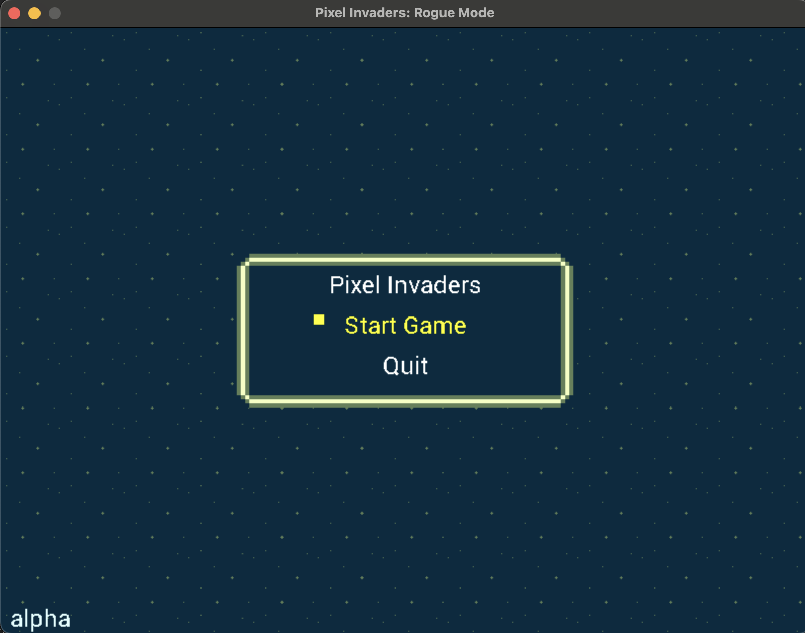
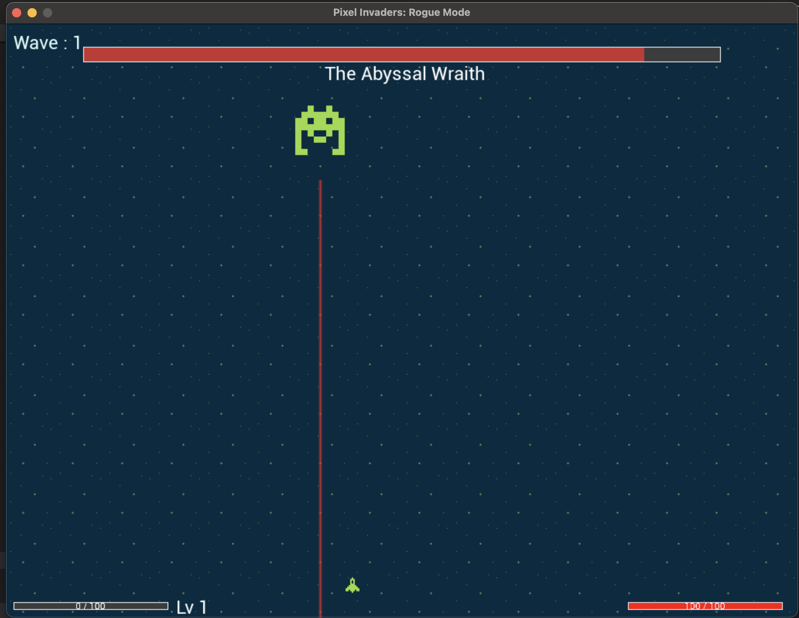
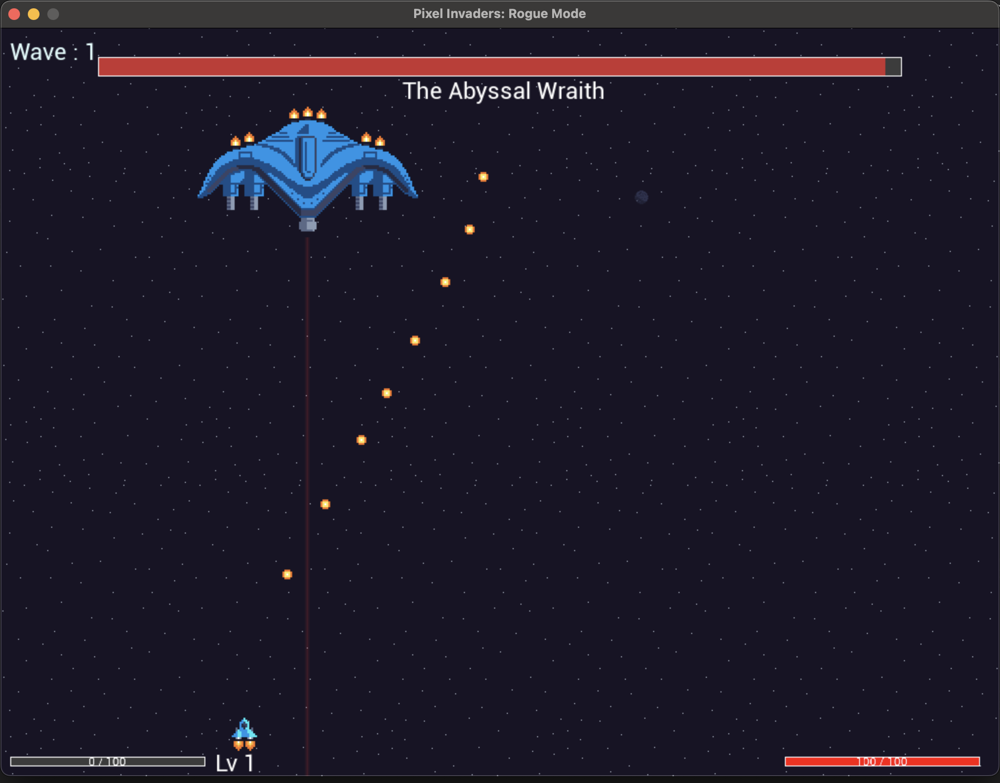

# **PixelInvaders**

**PixelInvaders** is a retro-inspired 2D shooter game written in **C** using **SDL2** and its extensions.
The game features enemy waves, upgrades, pickups, and roguelite-style mechanics such as player leveling and skill choices.

---

## **Features**

* 🚀 **Space shooter gameplay** with enemies, bullets, and pickups.
* 🏆 **Wave system** with progressive difficulty and bosses every 5 waves.
* ⚡ **Player upgrades** (e.g., multi-shot, shields, bullet speed, pickup magnet).
* 🎵 **Sound effects and background music** using SDL2\_mixer.
* 🎨 **Custom sprites and UI panels** with animated enemies and pickups.
* 🎮 **Cross-platform build** (Windows, macOS, Linux).

---

## **How to Play**

* **Movement:** `Arrow Keys` or `A`/`D`
* **Shoot:** `Space`
* **Select Upgrade:** `Up`/`Down` + `Enter` when the upgrade menu appears.
* **Goal:** Defeat enemy waves and survive as long as possible.
* **Pickups:** Collect dropped pickups for experience points.
* **Level Up:** Gain experience to level up and select powerful upgrades.

---

## **Screenshots**









---

## **Dependencies**

PixelInvaders is built on **SDL2** and its common extensions:

* [SDL2](https://github.com/libsdl-org/SDL)
* [SDL2\_image](https://github.com/libsdl-org/SDL_image)
* [SDL2\_ttf](https://github.com/libsdl-org/SDL_ttf)
* [SDL2\_mixer](https://github.com/libsdl-org/SDL_mixer)

On Linux, you can install these via:

```bash
sudo apt install libsdl2-dev libsdl2-image-dev libsdl2-ttf-dev libsdl2-mixer-dev
```

On macOS (via Homebrew):

```bash
brew install sdl2 sdl2_image sdl2_ttf sdl2_mixer
```

On Windows, the GitHub Actions pipeline fetches precompiled SDL2 binaries automatically.

---

## **Building from Source**

### **1. Clone the Repository**

```bash
git clone https://github.com/rayblair06/PixelInvaders.git
cd PixelInvaders
```

### **2. Build with CMake**

```bash
cmake -S . -B build
cmake --build build --config Release
```

The executable will be found at:

* **Linux/macOS:** `build/PixelInvaders`
* **Windows:** `build/PixelInvaders.exe`

---

## **Running the Game**

Make sure the `assets/` folder is in the same directory as the game binary:

```bash
./PixelInvaders
```

---

## **Cross-Platform Builds**

GitHub Actions automatically builds and packages **Windows**, **macOS**, and **Linux** releases using SDL2.

### **Building Manually for Windows**

If you are building locally on Windows, ensure SDL2 and its extensions are placed in the correct folders or add them to your CMake paths.

---

## **Development Notes**

* The project is modularized with separate files for **player**, **enemies**, **bullets**, **waves**, **audio**, and **UI**.
* Upgrades and game logic are defined in `upgrades.c`, `game.c`, and `waves.c`.
* `version.h` is auto-generated during builds with the Git tag and build date.

---

## **Contributing**

Pull requests are welcome! If you have ideas for new upgrades, enemy types, or visual effects, feel free to contribute.

---

## **License**

This project is licensed under the MIT License – see [LICENSE](LICENSE) for details.
