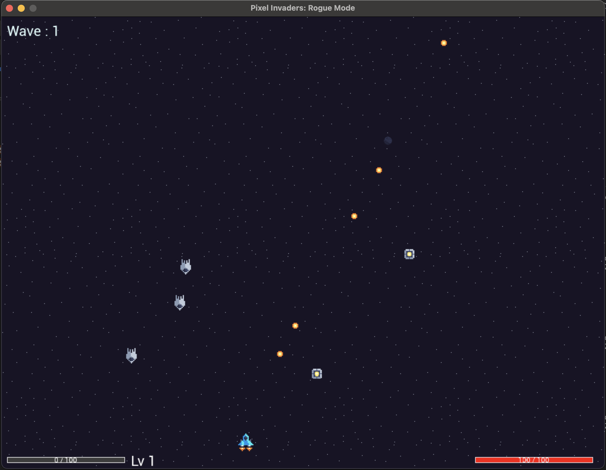
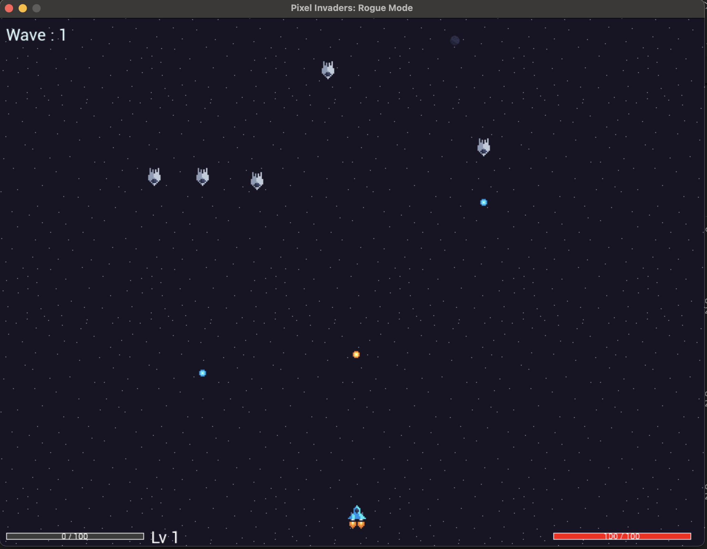

# **PixelInvaders: Rogue Mode**

**PixelInvaders** is a retro-inspired roguelike 2D space shooter written in **C** using **SDL2** and its extensions.  
Battle endless enemy waves, dodge intricate patterns, level up with powerful upgrades, and push for the highest wave in this modern twist on the classic arcade genre.

---

## **Features**

* 🚀 **Fast-paced space combat** with smooth controls and responsive movement.
* 🛸 **Enemy variety**:
  - **Drone** – basic shooter with steady pace.  
  - **Orbiter** – circles and spirals down the screen, hard to hit.  
  - **Razor** – boomerang-style dash attacker.  
  - **Viper** – fast, aggressive shooter.  
  - **Sentinel** – large twin-gun tank enemy.  
  - **Boss fights** – appear every 5 waves with unique mechanics.
* ⚔️ **Smaller, forgiving hitboxes** for tighter and more skill-based dodging.
* ⚡ **Player upgrades** – choose between branching skills like multi-shot, health regeneration, shields, pickup magnet, bullet speed boosts, and more.
* 🧩 **Roguelite progression** – gain EXP, pick upgrades each level-up, and push further each run.
* 🎵 **Immersive audio** – background music and sound effects powered by **SDL2_mixer**.
* 🎨 **Pixel-art sprites and UI** – animated enemies, projectiles, pickups, and effects.
* 🎛️ **Options Menu** – in-game settings for video modes (windowed, borderless, fullscreen) and resolution changes.
* 🕹️ **Cross-platform** – runs on Windows, macOS, and Linux via SDL2.

---

## **How to Play**

* **Move:** `Arrow Keys` or `A`/`D`  
* **Shoot:** `Space`  
* **Select Upgrades:** `Up`/`Down` + `Enter`  
* **Pause / Options:** `Esc`  
* **Goal:** Survive against endless waves, defeat bosses, and build powerful upgrade combos.  

Pick up **experience orbs** from defeated enemies, level up, and adapt your build each run.

---

## **Screenshots**

  
  


---

## **Dependencies**

PixelInvaders is built on **SDL2** and its common extensions:

* [SDL2](https://github.com/libsdl-org/SDL)
* [SDL2_image](https://github.com/libsdl-org/SDL_image)
* [SDL2_ttf](https://github.com/libsdl-org/SDL_ttf)
* [SDL2_mixer](https://github.com/libsdl-org/SDL_mixer)

### Install on Linux (Debian/Ubuntu)
```bash
sudo apt install libsdl2-dev libsdl2-image-dev libsdl2-ttf-dev libsdl2-mixer-dev
````

### Install on macOS (Homebrew)

```bash
brew install sdl2 sdl2_image sdl2_ttf sdl2_mixer
```

### Windows

The GitHub Actions pipeline fetches precompiled SDL2 binaries automatically.

---

## **Building from Source**

### 1. Clone the Repository

```bash
git clone https://github.com/rayblair06/PixelInvaders.git
cd PixelInvaders
```

### 2. Build with CMake

```bash
cmake -S . -B build -DCMAKE_BUILD_TYPE=Release
cmake --build build --config Release
```

Executables:

* **Linux/macOS:** `build/PixelInvaders` or inside `.app` bundle on macOS
* **Windows:** `build/PixelInvaders.exe`

---

## **Running the Game**

Make sure the `assets/` folder is in the same directory as the binary:

```bash
./PixelInvaders
```

---

## **Cross-Platform Builds**

GitHub Actions automatically builds and packages **Windows**, **macOS**, and **Linux** releases.

For Windows manual builds, ensure SDL2 and its extensions are correctly linked or placed in your CMake paths.

---

## **Development Notes**

* Modularized C source: `player.c`, `enemies.c`, `bullets.c`, `waves.c`, `audio.c`, `ui.c`, `options.c`, etc.
* Enemy AI and movement patterns are type-driven (`Drone`, `Orbiter`, `Razor`, `Viper`, `Sentinel`).
* Unified shooting system with cooldowns + jitter supports spread shots, aimed shots, and twin cannons.
* Hitboxes are center-scaled for fairness (player and enemies have smaller-than-sprite hit areas).
* `options.c` manages resolution and fullscreen/window modes.
* `version.h` is generated at build with Git tag + build date.

---

## **Contributing**

Pull requests are welcome!
Ideas for **new enemy patterns**, **player upgrades**, or **visual/audio effects** are especially appreciated.

---

## **License**

This project is licensed under the MIT License – see [LICENSE](LICENSE) for details.
